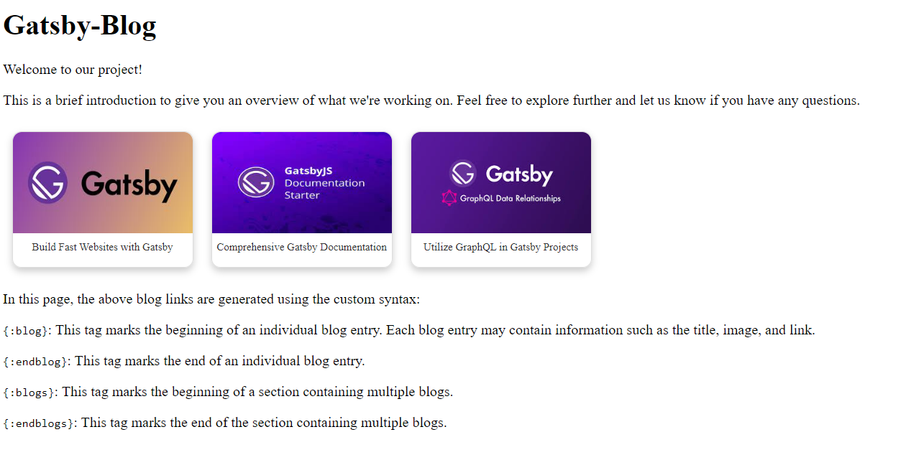

# Visual Blog Rendering Project 🚀

This project demonstrates the rendering of visual blogs from Markdown files using a custom syntax. Visual blogs are created using a specific syntax within Markdown files, and this project converts that syntax into visually appealing HTML content.

## Overview 🌐

Welcome to the Visual Blog Rendering project! The primary goal of this project is to showcase visually appealing blogs rendered from Markdown files using a custom syntax. Powered by Gatsby, a React-based framework, this project provides an efficient way to create and display engaging content.

## Screenshots 📸

*Visual Representation of Visual Blogs*



## Project Structure  🏗️

The project structure is designed to maintain clarity and modularity:

- **/src**: Contains the source code for the Gatsby project.
  - **/blog-components**: Houses components and utilities for blog rendering.
    - **blog.js**: Manages blog rendering functions and regular expressions.
    - **style.css**: Defines CSS styles for blog components.
  - **/mdfiles**: Stores Markdown files containing visual blogs.
  - **/pages**: Holds React components for various pages.
    - **index.js**: Handles homepage rendering and blog listing.
  - **/templates**: Stores React components for dynamic page templates.
    - **md-template.js**: Serves as the template for rendering Markdown content.

## Creating Visual Blogs 📝

Creating visual blogs involves a straightforward process:

1. **Parsing Markdown Files:**
   - Regular expressions are used to parse Markdown files and identify blog sections.
   - Information such as image, title, and link is extracted from the Markdown file using regex.

2. **Determining Number of Blogs to Render:**
   - The system decides how many blogs should be rendered based on the specified `maxBlogsToShow` variable.

3. **HTML Structure Generation:**
   - An HTML structure is created using the extracted information from the Markdown file.
   - The blog syntax in the Markdown file is replaced with dynamically generated HTML code.

This process is managed by the `createBlogs` function in the `blog.js` file located in the `/blog-components` directory.

## Usage 🚀

To use this project, follow the installation steps below. Additionally, you can create your visual blogs using the provided custom syntax.

## Installation ⚙️

1. Install dependencies:

    ```bash
    npm install
    ```

2. Run the development server:

    ```bash
    gatsby develop
    ```

3. Open your browser and navigate to [http://localhost:8000](http://localhost:8000) to view the rendered visual blogs.

## Styling 🎨

Styling for the visual blogs is defined in the `style.css` file within the `/blog-components` directory. Feel free to modify this file to customize the appearance of your visual blogs.

## Markdown Files 📂

Markdown files containing visual blogs are stored in the `/src/mdfiles` directory. Each Markdown file follows a specific structure with custom syntax to define visual blogs.

## Visual Blog Rendering 🖼️

The `gatsby-node.js` file contains logic for parsing Markdown files and creating pages for each visual blog. The `md-template.js` file defines the template for rendering Markdown content.

## Custom Syntax 🧩

Visual blogs are defined using a custom syntax within Markdown files. The syntax includes tags such as `{:blogs}`, `{:blog}`, `{:endblog}`, `{:endblogs}` to structure and identify visual blogs.

## HTML Generation ⚡

The HTML structure for visual blogs is generated dynamically based on the information extracted from Markdown files. This process is handled by the `blog.js` file in the `/blog-components` directory.

## Browsing Visual Blogs 🔍

1. After running the development server, open your browser and navigate to [http://localhost:8000](http://localhost:8000).
2. Click on any blog title to view the details and see the generated HTML code in the page source or browser developer tools.

## License 📜

This project is licensed under the MIT License - see the [LICENSE](LICENSE) file for details.
